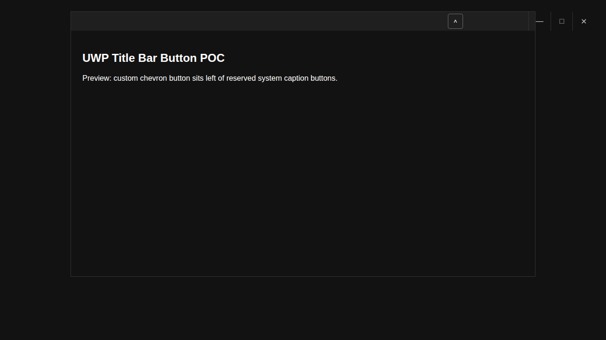

# uwp-titlebar-button-poc

POC UWP app (C# + XAML) that demonstrates a custom title bar region with an up-chevron button positioned near the top-right, while respecting the caption button reserved area.

## Project structure

- `UwpTitlebarButtonPoc.sln`
- `UwpTitlebarButtonPoc/UwpTitlebarButtonPoc.csproj`
- `UwpTitlebarButtonPoc/App.xaml` + `App.xaml.cs`
- `UwpTitlebarButtonPoc/MainPage.xaml` + `MainPage.xaml.cs`
- `.github/workflows/ci.yml`
- `.github/workflows/release.yml`
- `docs/titlebar-poc-preview.png` (visual preview)

## Required project configuration mapping

- Project type: UWP (legacy `.csproj`, XAML + C#)
- `OutputType`: `AppContainerExe`
- `TargetPlatformIdentifier`: `UAP`
- `TargetPlatformVersion`: `10.0.19041.0`
- `TargetPlatformMinVersion`: `10.0.18362.0`
- Platforms configured: `Any CPU`, `x86`, `x64`, `ARM`, `ARM64` (Any CPU maps to x86)
- `LangVersion`: `latest`
- `Use64BitCompiler`: `true`
- `RestoreProjectStyle`: `PackageReference`
- `AppxBundle`: `Always`
- `AppxBundlePlatforms`: `x86|arm`
- `UseDotNetNativeToolchain`: `false` for Release configs
- `global.json` includes `MSBuild.Sdk.Extras` `3.0.22`

## NuGet packages

Minimal package policy used:

- Required: `Microsoft.NETCore.UniversalWindowsPlatform` (only)
- Optional `Microsoft.UI.Xaml`: not added (not needed for this POC)

## Title bar POC behavior

- Uses `CoreApplication.GetCurrentView().TitleBar.ExtendViewIntoTitleBar = true`
- Calls `Window.Current.SetTitleBar(DragRegion)` for custom draggable area
- Handles `LayoutMetricsChanged` and `IsVisibleChanged`
- Uses `SystemOverlayRightInset` to keep the custom button just left of system caption buttons

## Feasibility and limitations

1. **Is a custom button in the title bar feasible in UWP?**
   - **Yes, partially.** You can extend into the title bar and place custom XAML UI in that area.

2. **Exact limitations around system caption button area**
   - The minimize/maximize/close region itself is **owned by the system** and is not replaceable in UWP.
   - You cannot draw over or intercept clicks in that reserved caption area.
   - Actual reserved width can change based on DPI/theme/window state; use `SystemOverlayRightInset` to adapt.

3. **Best workarounds when exact placement is not possible**
   - Reserve the system area using `SystemOverlayRightInset`.
   - Place custom button immediately to the left of the reserved area.
   - Provide fallback UX (same action in app content or command bar) if layout constraints make near-caption placement undesirable.

## CI workflow

- File: `.github/workflows/ci.yml`
- Triggers: `pull_request` and `push` to `main`
- Steps: checkout, restore, build Release x86 UWP package, upload artifacts

## Release workflow

- File: `.github/workflows/release.yml`
- Triggers: tag push `v*` and manual dispatch
- Steps: checkout, restore, build Release package, zip artifacts, create GitHub Release on tag and upload downloadables

## Packaging note (`.exe` feasibility)

For pure UWP, true standalone self-contained single `.exe` distribution is **not** the native packaging model. UWP is normally distributed as AppX/MSIX package(s)/bundle(s).

- This setup produces downloadable UWP package artifacts (AppX/MSIX/bundle outputs from build).
- A separate classic desktop bootstrapper `.exe` is possible only via additional desktop bridge/installer strategy, which is outside pure UWP minimal-POC scope.

## Build/run/release notes

- Build this solution on **Windows with Visual Studio UWP tooling installed**.
- Linux/macOS agents generally cannot fully build/package UWP app outputs.
- For local run/debug: open `UwpTitlebarButtonPoc.sln` in Visual Studio, choose target (`x86/x64/ARM/ARM64`), then run.
